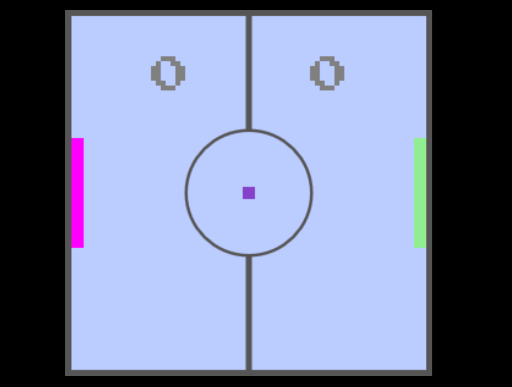

# HTML5 Pong

<h3>Project made with vanilla JS and HTML5 Canvas</h3>

### Player 1 controls: W / S
### Player 2 controls: Up Arrow / Down Arrow
### Start playing: Space

[Play the demo now!](https://sebastiansala.github.io/HTML5-Pong-Page)

<h5>Author: Sebastian Sala</h5>
